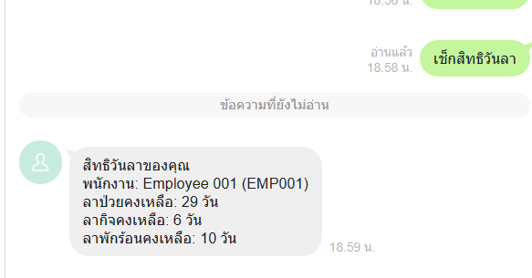
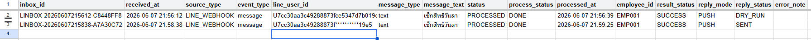
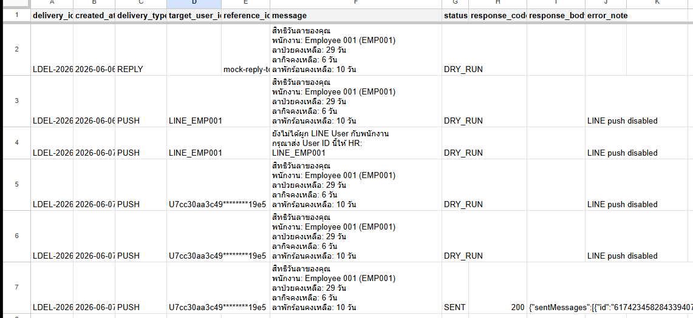

# WorkPulse LeaveOps

WorkPulse LeaveOps is a real LINE-integrated HR LeaveOps automation MVP built with Google Apps Script, Google Sheets, Cloudflare Worker, and LINE Messaging API.

## Project Status

- Portfolio / CV Ready: 100%
- Interview Demo Ready: 100%
- Internal Pilot Ready: 100%
- Production Enterprise Ready: Not claimed

## Tech Stack

- Google Apps Script
- Google Sheets
- LINE Messaging API
- Cloudflare Worker
- Queue-based workflow
- Webhook proxy
- Audit logs
- Health checks
- Regression tests

## Key Features

- Employee leave request workflow
- Supervisor approval / rejection
- HR confirmation
- Leave balance tracking
- Monthly summary and confirmation
- Dispute handling
- Optional field attendance
- LINE real message integration
- LINE push reply
- Queue-based webhook processing
- Kill switch and token guardrail

## Real LINE Architecture

LINE User
-> LINE Official Account
-> LINE Developers Webhook
-> Cloudflare Worker
-> LINE signature verification
-> Google Apps Script Web App
-> LINE_INBOX_QUEUE
-> Queue Worker
-> API Gateway
-> Core LeaveOps
-> LINE Push Reply

## Security Notes

This repository is a sanitized portfolio version.

No real company data, real access tokens, webhook secrets, or production Google Sheet IDs should be committed.

Secrets must be stored in:
- Google Apps Script Script Properties
- Cloudflare Worker Secrets

## Evidence

Screenshots are stored in the screenshots/ folder.

Recommended evidence:
- Real LINE reply success
- LINE_INBOX_QUEUE processed event
- LINE_DELIVERY_LOG sent result
- LINE Webhook verify success
- Cloudflare Worker ready
- Phase 13 final check passed

## Roadmap

- Database migration readiness
- HR Admin web panel
- LINE Rich Menu / Flex Message
- Production-grade permission system
- Monitoring and alerting
- Multi-company SaaS direction

## Portfolio Evidence

### 1. Real LINE Reply Success

### 2. LINE Inbox Queue Processed

### 3. LINE Delivery Log

More evidence screenshots are available in the screenshots folder.

## Documentation

- [Architecture](docs/architecture.md)
- [Architecture Diagram](docs/architecture-diagram.txt)
- [Demo Script](docs/demo-script.md)
- [Pilot Readiness](docs/pilot-readiness.md)
- [Security Notes](docs/security-notes.md)
- [Roadmap](docs/roadmap.md)
- [Sample Configuration](samples/sample-config.md)
- [Sample LINE Payload](samples/sample-line-payload.json)
- [Sample Sheet Structure](samples/sample-sheet-structure.md)
